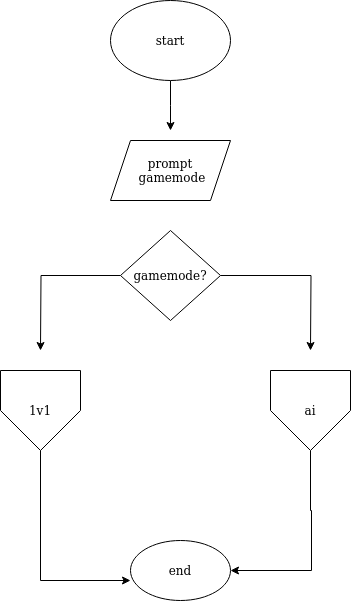
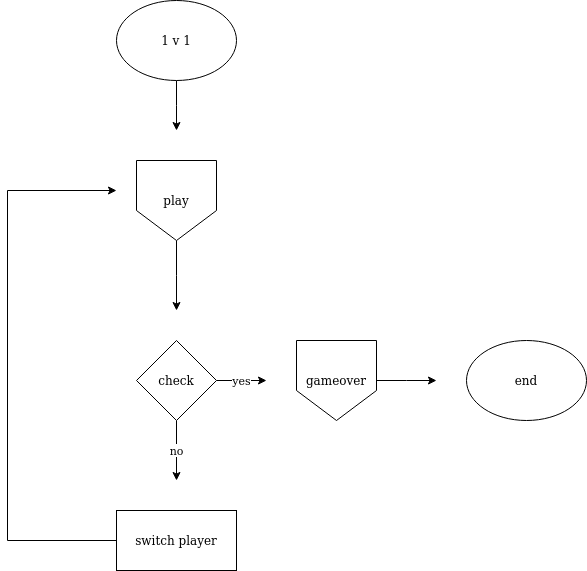
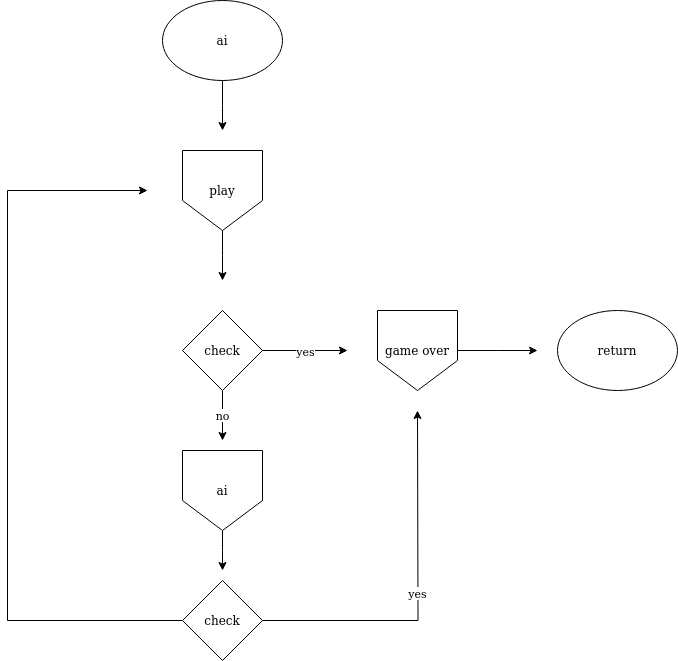
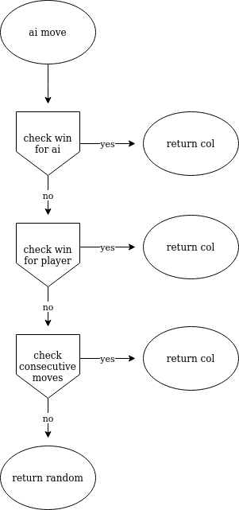

# Connect-4
Connect 4 team project 

the following are flowcharts for the program:

as for the PvP gamemode:
<diiv align="center">

and the Player vs AI gamemode:

and for the way the ai plays:

